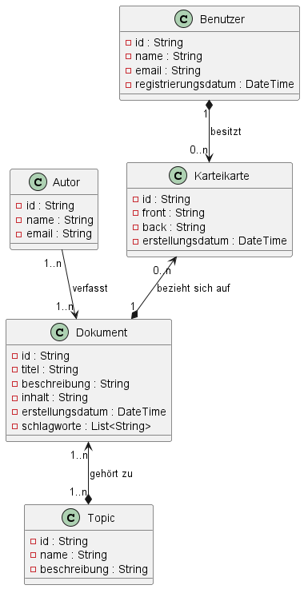

# LearnDB
 Das Ziel des Projekts ist die Entwicklung einer Anwendung, die Lernenden ermöglicht, ihr Wissen in einer NO-SQL Datenbank zu speichern und zu verwalten. Zudem wird eine grundlegende Verwaltung von Kursen ermöglicht. Die Anwendung soll dabei nicht nur passive Speicherung, sondern auch aktives Lernen unterstützen. Dies soll zunächst durch Karteikarten erfolgen. 

**Use Case Beschreibung**
Die folgenden Use Cases sind geplant:
- Dokumentverwaltung: Ein Benutzer legt ein neues Dokument an, fügt es einem Topic und einem Kurs hinzu und sucht später nach diesem Dokument über die Suchfunktion.
- Kurseinstellung: Ein Benutzer erstellt einen neuen Kurs, fügt ihm Topics und Dokumente zu und suchtmithilfe der Suchfunktion nach relevanten Inhalten für den Kurs.
- Karteikarten: Ein Benutzer erstellt Karteikarten basierend auf einem Dokument oder Topic eines Kurses und nutzt diese zum Lernen.
- Suche: Ein Benutzer gibt einen Suchbegriff ein und erhält eine Liste von Dokumenten, die zu diesem Begriff passen.
         
**Installation**
Um dieses Projekt lokal auszuführen muss man es klonen, im Ordner 'learndb' eine eigene .env Datei erstellen und dann mit Docker ausführen. MongoDB muss installiert sein. Das heisst: 

git clone https://github.com/Silivanili/LearnDB.git

cd LearnDB

Im Ordner 'learndb' eine Datei namens '.env' mit diesem Inhalt erstellen: 

# .env
PROJECT_NAME=LearnDB
MONGODB_URL=mongodb://mongodb:27017/
MONGODB_DATABASE=learn_db
MONGODB_COLLECTION=dokumente

docker-compose up --build

**Data Dump**

Zunächst müssen die Testdaten in den Container kommen. Dazu diesen Befehl (im Ordner app) ausführen

docker cp ./mongo-dump learndb-mongodb-1:/data/dump

Dannach können die Daten importiert werden

docker exec -it learndb-mongodb-1 mongodump --uri="mongodb://mongodb:27017" --out=/data/dump

**API Dokumentation**

Dieses Projekt benutzt SwaggerUI, womit die API getestet werden kann. Hier ein Beispiel für ein Dokument: 

Dokumente erstellen: 

curl -X POST "http://localhost:8888/api/dokument/" \
    -H "Content-Type: application/json" \
    -d '{
      "titel": "NoSQL Grundlagen",
      "beschreibung": "Ein Überblick über NoSQL-Datenbanken",
      "inhalt": "MongoDB, CouchDB und mehr...",
      "schlagworte": ["NoSQL", "Datenbanken", "MongoDB"],
      "kurs": "Einführungskurs"
    }'

Ein Dokument einlesen: 

curl http://localhost:8888/api/dokument/{document_id}

Ein Dokument updaten: 

curl -X PUT "http://localhost:8888/api/dokument/{document_id}" \
  -H "Content-Type: application/json" \
  -d '{
    "titel": "NoSQL Basics (aktualisiert)",
    "beschreibung": "Überblick über NoSQL-Systeme",
    "inhalt": "MongoDB und andere NoSQL-Datenbanken...",
    "schlagworte": ["NoSQL", "MongoDB", "CouchDB"],
    "kurs": "Einführungskurs"
  }'

Ein Dokument löschen: 

curl -X DELETE http://localhost:8888/api/dokument/{document_id}

**MSCW-Kriterien**

- **Must Have:**
  - CRUD-Operationen für Dokumente und Topics implementieren.
  - Erstellung, Lesen, Bearbeiten und Löschung von Kursen sowie Zuweisung von Dokumenten und Topics zu Kursen.
  - REST-Schnittstelle für alle Operationen bereitstellen, einschließlich Suchfunktion.
  - Daten in einer NoSQL-Datenbank (MongoDB) speichern.
  - Anwendung containerisieren (Docker).
  - Ausführliche Dokumentation liefern.
  - Code in einem Git-Repository verfügbar machen.
  - Karteikartenfunktion für aktives Lernen umsetzen.

- **Should Have:**
  - Volltextsuche für Dokumente anhand von Titel, Inhalt oder Schlagwörtern implementieren.
  - Logging und grundlegende Fehlerbehandlung integrieren.
  - Rudimentäre Benutzerverwaltung als Platzhalter für spätere Erweiterungen.

     
    
- **Could Have:**
  - Weitere Lernfeatures wie Quizzes hinzufügen. 
  - Speicherung von Fortschritten und Statistiken zu den Kursen und Karteikarten eines Benutzers.

- **Won't Have:**
  - Es wird keine vollwertige Frontend-Benutzeroberfläche entwickelt – der Fokus liegt auf der Backend-Implementierung und der REST-API.

**UML-Klassendiagramm**
Hier ist das momentane Klassendiagramm

**Techstack**
- Backend: FastAPI für die Implementierung der REST-Schnittstelle. Pydantic für die Validierung und SwaggerUI für das testen.
- Datenbank: MongoDB als NoSQL-Datenbank.
- Containerisierung: Docker für die Verwaltung des Services.